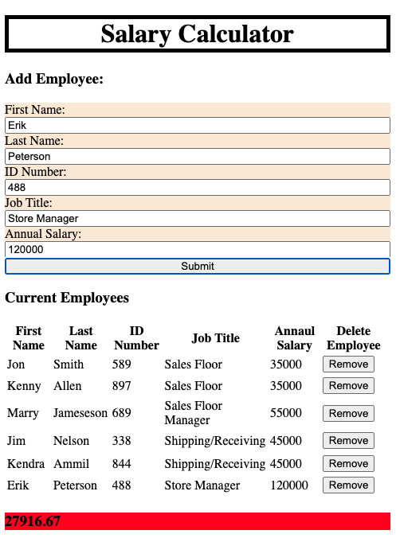

# Project Name
Salary Calculator

## Description
Salary calculator to keep company payroll within the budget.

Enter employee Name, ID number, Job title and annual salary.

Company has a maximum payroll of $20,000 per month. 

If monthly salary exceeds listed maximum amount, the total dollar amount at the bottom of the page will turn red.

You have to option to delete employees to reduce monthly total.

## Preview

## Made with
javascript
HTML5
CSS